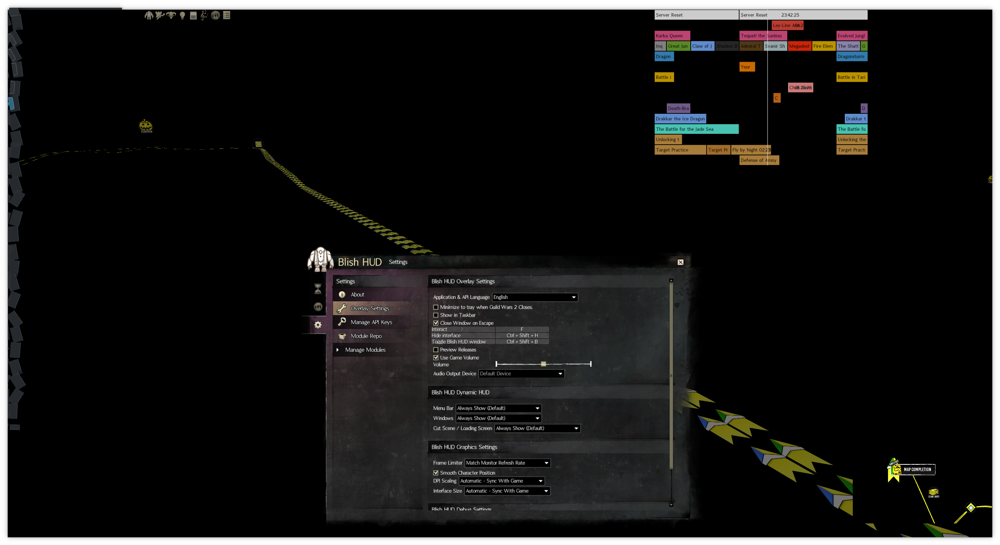

# KDE Color Translucency Effect

This KDE Desktop Effect allows for rendering a specific color as transparent within window contents, for use with software such as overlays.


| WITHOUT EFFECT | WITH EFFECT |
| -------------- | ----------- |
|  |  |


## Description

The Color Translucency Effect is an enhancement for KDE Plasma desktops, enabling the rendering of specific colors as transparent within the contents of a window.


## Installation

Before installation, ensure you have installed the necessary dependencies. The following are based on the original KDE Rounded Corners project and may not be exhaustive.

For Ubuntu/Debian based systems:

```bash
sudo apt install git cmake g++ gettext extra-cmake-modules qttools5-dev libqt5x11extras5-dev libkf5configwidgets-dev libkf5globalaccel-dev libkf5notifications-dev kwin-dev
```

For Fedora:

```bash
sudo dnf install git cmake gcc-c++ extra-cmake-modules qt5-qttools-devel qt5-qttools-static qt5-qtx11extras-devel kf5-kconfigwidgets-devel kf5-kcrash-devel kf5-kguiaddons-devel kf5-kglobalaccel-devel kf5-kio-devel kf5-ki18n-devel kwin-devel qt5-qtbase-devel libepoxy-devel
```

For openSUSE:

```bash
sudo zypper install git cmake gcc-c++ extra-cmake-modules libqt5-qttools-devel libqt5-qtx11extras-devel kconfigwidgets-devel kguiaddons-devel kglobalaccel-devel ki18n-devel knotifications-devel kwin5-devel libQt5Gui-devel libQt5OpenGL-devel libepoxy-devel kwindowsystem-devel libqt5-qtnetworkauth-devel
```

For Void Linux:

```bash
xbps-install git cmake make qt5-tools-devel extra-cmake-modules qt5-x11extras-devel gettext-devel kwin-devel
```

Then compile and install the effect:

```bash
git clone https://github.com/aaronkirschen/KDE-Color-Translucency.git
cd KDE-Color-Translucency
mkdir build
cd build
cmake .. --install-prefix /usr
make
sudo make install
```

To activate the new effect, restart KWin:

```bash
kwin_x11 --replace &
```

Alternatively, you can log out and back in.


## Uninstallation

To uninstall the effect:

```bash
sudo make uninstall
```

Note: Run this command from the build directory of your installation.


## Usage

Configure the effect in the KDE System Settings under Desktop Effects. The 'ColorTranslucency' effect will appear in the list where its settings can be adjusted.


## Building

For building from the source, ensure all dependencies are installed:

```bash
mkdir build
cd build
cmake ..
make
```


## Contributing

Contributions are welcome. Please report issues or suggest improvements through the project's GitHub page.


## License

Licensed under the GPL v3 License - see the LICENSE file for details.


## Credits

This effect is based on the KDE Rounded Corners project, modified to include color translucency functionality. For a comprehensive list of contributors to the original project, please refer to the [original repository](https://github.com/matinlotfali/KDE-Rounded-Corners).
